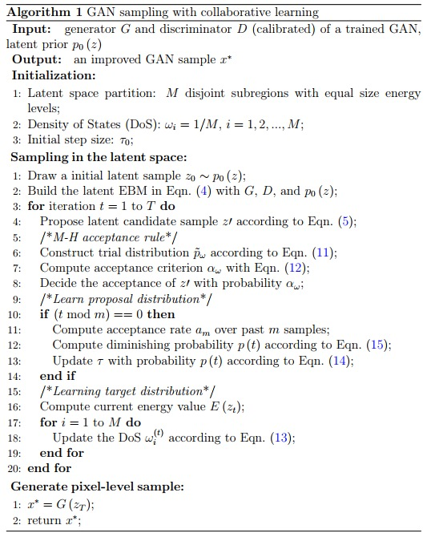

# collaborative-learn
This is the official implementation of "WL-GAN: Learning where to sample in generative latent space", which aims at improving the sample quality of trained GANs with generative latent space sampling.

## Abstract
Recent advances in generative latent space sampling for enhanced generation quality have demonstrated the benefits from the Energy-Based Model (EBM), which is often defined by both the generator and the discriminator of off-the-shelf Generative Adversarial Networks (GANs) of many types. However, such latent space sampling may still suffer from mode dropping even sampling in a low-dimensional latent space, due to the inherent complexity of the data distributions with rugged energy landscapes. In this paper, we propose WL-GAN, a collaborative learning framework for generative latent space sampling, where both the invariant distribution and the proposal distribution are jointly learned on the fly, by exploiting the historical statistics behind the samples of the Markov chain. We show that the two learning modules work together for better balance between exploration and exploitation over the energy space in GAN sampling, alleviating mode dropping and improving the sample quality of GAN. Empirically, the efficacy of WL-GAN is demonstrated on both synthetic datasets and real-world image datasets, using multiple GANs.

## Requirements
numpy
tqdm
torch
torchvision

## Data

## Training

## Acknowledgment
Our project references the codes in the following repos. Thanks for their works and sharing.
- [REPGAN](https://github.com/yifeiwang77/repgan)
- [GAN1]
- [GAN2]
- [GAN3]
