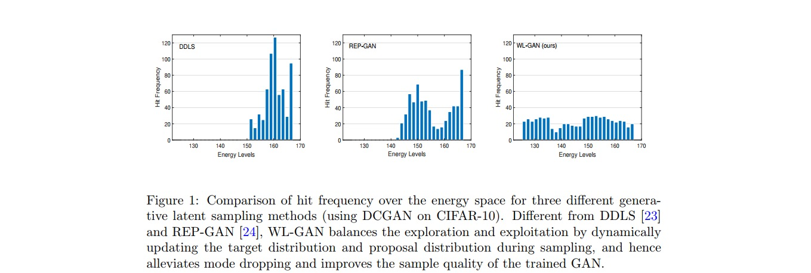

# collaborative-learn
This is the official implementation of "WL-GAN: Learning where to sample in generative latent space", which boost the sample quality of trained GANs with collaborative learning in latent space sampling.

The framework is inherited from [REPGAN](https://github.com/yifeiwang77/repgan), thanks for their works and sharing.

## Abstract
Recent advances in generative latent space sampling for enhanced generation quality have demonstrated the benefits from the Energy-Based Model (EBM), which is often defined by both the generator and the discriminator of off-the-shelf Generative Adversarial Networks (GANs) of many types. However, such latent space sampling may still suffer from mode dropping even sampling in a low-dimensional latent space, due to the inherent complexity of the data distributions with rugged energy landscapes. In this paper, we propose WL-GAN, a collaborative learning framework for generative latent space sampling, where both the invariant distribution and the proposal distribution are jointly learned on the fly, by exploiting the historical statistics behind the samples of the Markov chain. We show that the two learning modules work together for better balance between exploration and exploitation over the energy space in GAN sampling, alleviating mode dropping and improving the sample quality of GAN. Empirically, the efficacy of WL-GAN is demonstrated on both synthetic datasets and real-world image datasets, using multiple GANs.



## Requirements
`torch`
`torchvision`
`numpy`
`tqdm`
`h5py`


## Data
We investigate the collaborative learning on three real-world image datasets, including ```CIFAR-10```, ```CelebA``` and ```ImageNet-100``` (a 100-class subset of ImageNet), with different GAN models.

## GAN models
We train three different GANs (i.e., ```DCGAN```, ```WGAN```, and ```SNGAN```) on CIFAR-10 and CelebA for empirical evaluation. As for ImageNet-100, we only implement ```BigGAN``` because the training of other baseline models is unstable.

Notice: We use the two configurations of "DCGAN & CelebA" and "BigGAN & ImageNet-100" as examples. Other architectures can also be adapted to fit our algorithm as it is model agnostic.

## Usage
### GAN Sampling with WL-GAN

DCGAN & CelebA :
```
python main.py --dataroot [dataroot] --load-g [generator filename] --load-d [discriminator filename] --calibrate --num-images 50000
```

Other atchitecture:
Customized Sampling: modify the ```collaborative_learn``` function in ```collaborative_learn.py```.
```
def collaborative_learn(netG, 
        netD, 
        calibrator, 
        device, 
        nz=100,
        batch_size=100, 
        clen=640, 
        tau=0.1, 
        eta=0.3162):
    '''
    1) network config
    netG: generator network. Input: latent (B x latent_dim x 1 x 1). Output: images (B x C x H x W)
    netD: discriminator network. Input: images (B x C x H x W). Output: raw score (B x 1)
    calibrator: calibrator network for calibrating the discriminator score. Input: raw score (B x 1). Ouput: calibrated score: (B x 1)
    nz: the dimension of the latent z of the generator
    2) sampling config
    batch_size: number of samples per batch
    clen: length the Markov chain (only the last sample at the end of the chain is left)
    tau: step size in L2MC
    eta: scale of  white noise in L2MC. Default: sqrt(tau)
    3) update rule
    Collaborative learn: Target distribution learning & Proposal distribution learning
    '''
```

BigGAN & ImageNet-100:
```
./scripts/run_biggan_deep.sh
```


## Acknowledgment
Our project references the codes in the following repos. Thanks for their works and sharing.
- [REPGAN](https://github.com/yifeiwang77/repgan)
- [MHGAN](https://github.com/uber-research/metropolis-hastings-gans)
- [DCGAN](https://github.com/pytorch/examples/blob/master/dcgan/main.py)
- [BigGAN](https://github.com/ajbrock/BigGAN-PyTorch)
